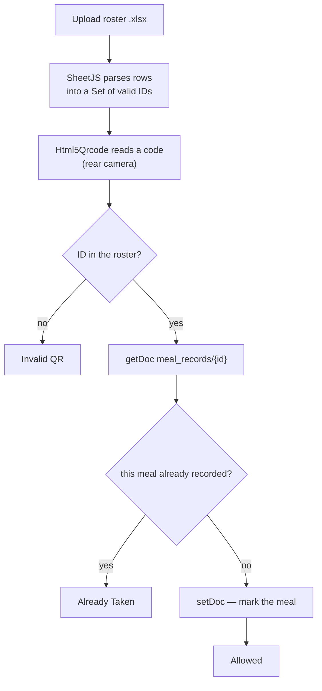

<p align="center">
  
  
  
</p>

A meal counter that a volunteer can run from a phone. Upload the day's roster as a
spreadsheet, point the camera at a participant's QR code, and the screen says one of
three things: **Allowed**, **Already Taken**, or **Invalid QR**.

Deliberately small — no backend to deploy, no accounts to manage. The roster is a file
you already have, and Firestore holds the one thing that must survive a page refresh:
who has eaten.

## The scan loop



Two checks, in this order, and the order matters. Membership is tested in memory against
a `Set`, so an unknown code is rejected without ever touching the network. Only a code
that belongs to somebody costs a Firestore read.

Each meal is a field on a single `meal_records/{id}` document, so breakfast, lunch and
dinner are tracked independently for the same person.

## Running it

```bash
npm install && npm run dev
```

Create `.env` with your Firebase web app config:

```
VITE_FIREBASE_API_KEY=
VITE_FIREBASE_AUTH_DOMAIN=
VITE_FIREBASE_PROJECT_ID=
VITE_FIREBASE_STORAGE_BUCKET=
VITE_FIREBASE_MESSAGING_SENDER_ID=
VITE_FIREBASE_APP_ID=
```

Then pick a meal, upload the roster, and start scanning.

## The roster file

Any `.xlsx` whose rows carry the participant IDs — SheetJS reads the first sheet via
`sheet_to_json`, so a plain export from your registration system usually works unchanged.

> [!IMPORTANT]
> The camera only opens in a secure context. `localhost` is fine for development, but a
> phone on your LAN needs HTTPS or the browser will silently refuse to start the scanner.

> [!NOTE]
> Firestore rules are the security boundary here — the client writes directly. Lock
> `meal_records` down to authenticated volunteers before using this at a real event, or
> anyone with the web config can mark meals as served.

## Screenshots

_Drop images into `docs/screenshots/` and reference them here — the scanner showing an
"Already Taken" result is the frame that explains the whole app._

## Licence

[MIT](LICENSE) © Guruprasad Jena
